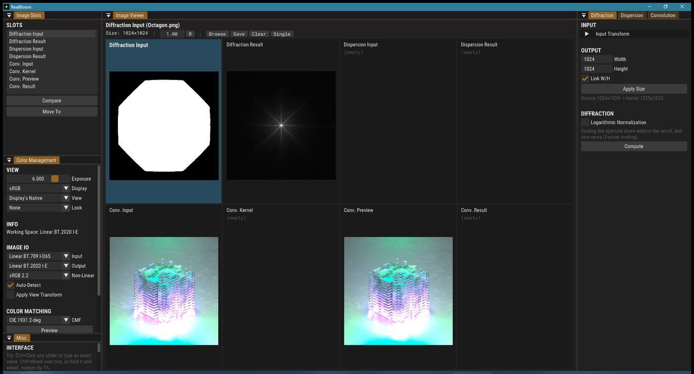
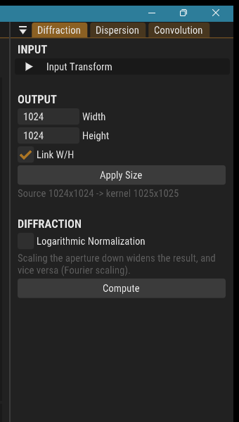
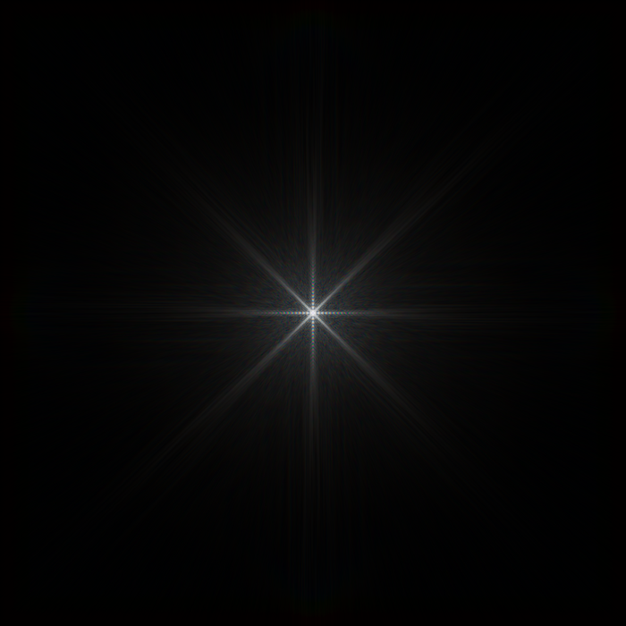

<!-- Improved compatibility of back to top link: See: https://github.com/othneildrew/Best-README-Template/pull/73 -->
<a name="readme-top"></a>
<!--
*** Thanks for checking out the Best-README-Template. If you have a suggestion
*** that would make this better, please fork the repo and create a pull request
*** or simply open an issue with the tag "enhancement".
*** Don't forget to give the project a star!
*** Thanks again! Now go create something AMAZING! :D
-->

<!-- PROJECT LOGO -->
<br />
<div align="center">
  <a href="https://github.com/bean-mhm/realbloom">
    
  </a>
<h3 align="center">RealBloom</h3>
  <p align="center">
    Bloom Simulation Software
  </p>
</div>


<!-- TABLE OF CONTENTS -->
<details>
  <summary>Table of Contents</summary>
  <ol>
    <li><a href="#fork-changes">Fork Changes</a></li>
    <li><a href="#introduction">Introduction</a></li>
    <li><a href="#how-its-made">How It's Made</a></li>
    <li><a href="#how-to-run">How To Run</a></li>
    <li><a href="#how-to-use">How To Use</a></li>
    <li><a href="#how-to-build">How To Build</a></li>
    <li><a href="#contributing">Contributing</a></li>
    <li><a href="#license">License</a></li>
    <li><a href="#contact">Contact</a></li>
  </ol>
</details>


<!-- FORK CHANGES -->
# Fork Changes

This is a fork of [bean-mhm/realbloom](https://github.com/bean-mhm/realbloom) with two
independent sets of changes: making v0.8.0 build against current dependencies, and a
rework of the image viewer. Everything else is upstream's work.

## Building against current OpenColorIO / OpenImageIO

v0.8.0 targets OCIO 2.1 and OIIO 2.4. Current vcpkg ships OCIO 2.5 and OIIO 3.1, which
breaks the build in three places:

| Problem | Fix |
|--|--|
| Five files hardcoded `namespace OCIO = OpenColorIO_v2_1` | Use the version-agnostic `OCIO_NAMESPACE` macro, so future OCIO bumps do not break it again |
| OCIO 2.5 added a `TextureDimensions` out-param to `GpuShaderDesc::getTexture()` | Pass it through; the existing height-based `GL_TEXTURE_1D`/`2D` choice still holds, so behaviour is unchanged |
| OIIO 3.x moved `TypeDesc::TypeString` to namespace-level `OIIO::TypeString`, and its bundled fmt requires `/utf-8` | Updated the call site and added the compiler flag |

These are compatibility shims, not behaviour changes. Verified by rendering a hexagon
aperture diffraction pattern through the CLI and comparing against the official v0.8.0
release binary: **0 of 1,050,625 pixels differ**.

They are isolated in a single commit on the [`ocio-oiio-compat`](../../tree/ocio-oiio-compat)
branch, which applies cleanly to upstream `main` on its own.

## Image viewer



The viewer showed one image slot at a time, which turned out to be the root of several
separate annoyances: *Compare* existed only to flip around it, drag-and-drop had to
target "the selected slot", and the module tabs drifted out of sync with the slot being
worked on. Above, an aperture and its diffraction pattern are visible side by side, with
no slot switching.

- **Split view** of all 8 slots in an adaptive grid. Double-click a pane to maximise it,
  double-click again to go back.
- **Drag one pane onto another** to copy its image, Shift to move. This is how modules
  chain (Diffraction Result into Conv. Kernel), previously only possible via a dialog.
- **Right-click a pane** for Browse / Save / Clear.
- **Cursor-anchored zoom** in single view, with drag to pan. Files dropped from the OS
  land in the pane under the cursor.

Note that each slot now owns its framebuffer. `CmImage` defaults to a single shared
static framebuffer, which is fine when only one image is ever on screen but makes every
pane of a grid display whatever rendered last. The cost is one framebuffer per populated
slot, roughly 16 MB at 1024x1024.

## Interaction

- **Mouse wheel over a slider** adjusts it by 1% of its range. Requires holding the
  slider or holding Ctrl, so scrolling a panel never silently edits a value it passes over.
- **Selecting a slot brings its module tab forward**, so the panel always matches the
  image being worked on.
- **Live dispersion preview**, with a cost guard that backs off once steps x pixels gets
  expensive. Diffraction is deliberately left manual: its `compute()` is synchronous on
  the UI thread, so a live version would freeze the window.
- Tooltips for *Compare* and *Move To*, and a note that aperture size and pattern size
  are reciprocal, which is the most common source of confusion for new users.

## Explicit kernel resolution



Output size was only reachable through a *Resize* multiplier on the input transform.
Since a kernel's pixel dimensions are what set the glare's reach in a compositor, the
Diffraction panel now takes an explicit width and height, with an optional aspect link,
and reports the resulting kernel size including the FFT's odd-size padding.

The underlying multiplier is re-derived whenever the source image changes, so an
explicit target survives loading a different aperture.

Sliders elsewhere accept exact values too: **Ctrl+Click any slider to type into it**.
That is stock Dear ImGui behaviour that was simply never documented.

<br clear="right">

## Example output

A dispersed diffraction kernel generated from `demo/Apertures/Octagon.png`, ready to drop
into a compositor as a glare or convolution kernel:



Generated headlessly in about two seconds at 512 dispersion steps:

```sh
RealBloom.exe cli
> diff -i "demo/Apertures/Octagon.png" -a sRGB -o d.exr -p "Linear BT.709 I-D65"
> disp -i d.exr -a "Linear BT.709 I-D65" -o kernel.exr -p "Linear BT.709 I-D65" -d 0.4 -e 0 -s 512
```

When exporting kernels for a compositor, set **Output** in Color Management > IMAGE IO to
match the target's scene-linear space and leave **Apply View Transform** off, otherwise a
display transform gets baked into what should be linear data.

<p align="right">(<a href="#readme-top">back to top</a>)</p>


<!-- INTRODUCTION -->
# Introduction

RealBloom is a bloom simulation / post processing tool for achieving more realism in 3D renders and HDR images.


RealBloom was started as a hobby project in late August 2022, inspired by [AngeTheGreat's video](https://www.youtube.com/watch?v=QWqb5Gewbx8) on bloom and how to simulate it in a physically accurate manner. I highly recommend watching this video to get a basic understanding of how RealBloom works. Make sure to check out their [GitHub page](https://github.com/ange-yaghi) and their other projcets!

The ultimate goal of bloom is to achieve more realism in 3D renders that contain bright spots on dark backgrounds. For example, the sun in a blue sky, a car headlight at night, bright lights at a concert, a flashlight pointing directly at the camera, you name it.

RealBloom can be used to produce some other effects, including film halation, motion blur with arbitrary curves, uniform lens blur, etc. These, and more, can be achieved with the three main modules in RealBloom:

- Diffraction (2D FFT)
- Dispersion
- Convolution

# How It's Made

RealBloom is written in C++ with Visual Studio 2022. The target platform is Windows. However, considering all the libraries used and most of the code for RealBloom are platform-independent, it should be fairly easy (ish) to port to other major desktop platforms.

## Libraries Used
| Library | Used for |
|--|--|
| [GLEW](https://glew.sourceforge.net/) | OpenGL extensions |
| [GLFW](https://www.glfw.org/) | Window and context creation |
| [Dear ImGui](https://github.com/ocornut/imgui) | Graphical user interface |
| [NFD Extended](https://github.com/btzy/nativefiledialog-extended) | Native file dialogs |
| [OpenColorIO](https://opencolorio.org/) | Color management |
| [OpenImageIO](https://github.com/OpenImageIO/oiio) | Reading and writing images |
| [PocketFFT](https://github.com/mreineck/pocketfft) | 2D Fast Fourier Transforms |
| [dj_fft](https://github.com/jdupuy/dj_fft) | 2D FFT on the GPU |
| [pugixml](https://pugixml.org/) | Parsing and serializing XML files |
| [Rapidcsv](https://github.com/d99kris/rapidcsv) | Parsing CSV files |

<p align="right">(<a href="#readme-top">back to top</a>)</p>


<!-- RUNNING -->
# How To Run

RealBloom requires [Microsoft Visual C++ Runtime](https://learn.microsoft.com/en-us/cpp/windows/latest-supported-vc-redist?view=msvc-170) in order to run properly. To get RealBloom, you can [download the latest release here](https://github.com/bean-mhm/realbloom/releases).

## Minimum Requirements

 - 64-bit version of Windows

 - 4 GB of RAM

 - GPU with OpenGL 3.2 support

<p align="right">(<a href="#readme-top">back to top</a>)</p>


<!-- USAGE -->
# How To Use

If you're using RealBloom for the first time, check out [this step-by-step tutorial][tutorial] on getting started with RealBloom, along with more details and information about the project. This will cover most of what you need to know.

<p align="right">(<a href="#readme-top">back to top</a>)</p>


<!-- BUILDING -->
# How To Build

## Prerequisites

The project was made for Windows and built with MSVC. To build a local copy of RealBloom, have a recent version of Visual Studio ready.

RealBloom uses [vcpkg](https://vcpkg.io/en/index.html) to link some of the libraries, specifically, [OpenColorIO](https://opencolorio.org/) and [OpenImageIO](https://github.com/OpenImageIO/oiio). Here are the basic steps to install vcpkg and the mentioned libraries.

1. Follow the [vcpkg installation instructions](https://github.com/Microsoft/vcpkg#quick-start-windows) to install vcpkg and **enable Visual Studio integration**.

2. Run the following command from vcpkg's root directory:
   ```sh
   vcpkg install openimageio[opencolorio,tools]:x64-windows --recurse
   ```

Note that this might take some time to finish.

## Build

Now, to build RealBloom,

1. Clone the repo:
   ```sh
   git clone https://github.com/bean-mhm/realbloom.git
   ```

2. Open `RealBloom.sln` in Visual Studio.

3. Build the solution and run `RealBloom.exe`. Feel free to explore and play with the code!

<p align="right">(<a href="#readme-top">back to top</a>)</p>


<!-- CONTRIBUTING -->
# Contributing

Contributions are what make the open source community such an amazing place to learn, inspire, and create. Any contributions you make are **greatly appreciated**.

If you have a suggestion that would make this better, please fork the repo and create a pull request. You can also simply open an issue with the tag "enhancement". Don't forget to give the project a star! Thanks again!

1. Fork the Project
2. Create your Feature Branch (`git checkout -b feature/AmazingFeature`)
3. Commit your Changes (`git commit -m 'Add some AmazingFeature'`)
4. Push to the Branch (`git push origin feature/AmazingFeature`)
5. Open a Pull Request

See [open issues](https://github.com/bean-mhm/realbloom/issues) for a full list of proposed features (and known issues).

<p align="right">(<a href="#readme-top">back to top</a>)</p>


<!-- LICENSE -->
# License

Distributed under the [AGPL-3.0 license](https://github.com/bean-mhm/realbloom/blob/main/LICENSE.md). See [LICENSE.md](LICENSE.md) for more information.

<p align="right">(<a href="#readme-top">back to top</a>)</p>


<!-- CONTACT -->
# Contact

☀️ **RealBloom Community Server:** [Discord](https://discord.gg/Xez5yec8Hh)

🧑‍💻 **bean (Developer):** [Email](mailto:harry.bean.dev@gmail.com)

🔗 **Project Link:** [GitHub](https://github.com/bean-mhm/realbloom)

<p align="right">(<a href="#readme-top">back to top</a>)</p>


<!-- MARKDOWN LINKS & IMAGES -->
<!-- https://www.markdownguide.org/basic-syntax/#reference-style-links -->
[product-screenshot]: images/screenshot.png
[tutorial]: https://github.com/bean-mhm/realbloom/blob/main/docs/v0.7.0-beta/tutorial.md
